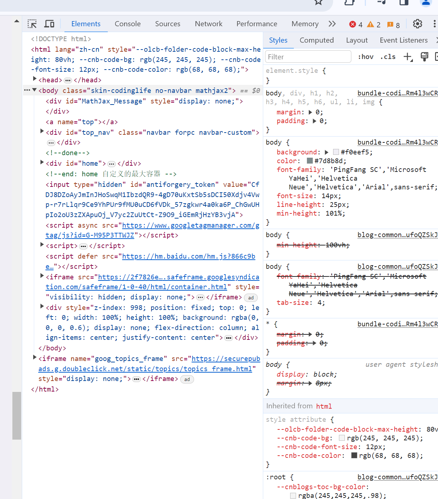
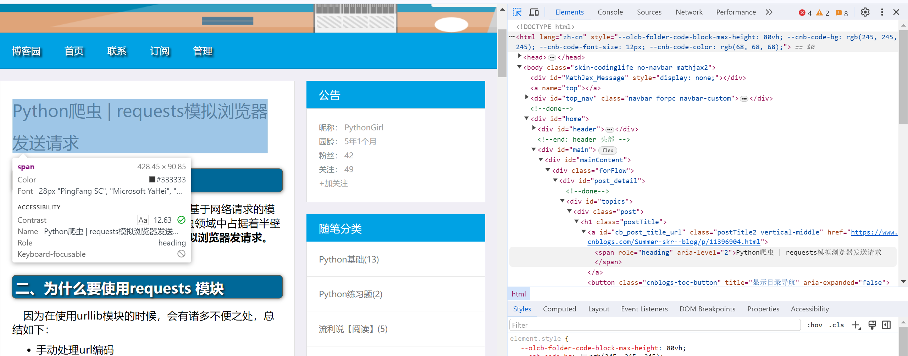
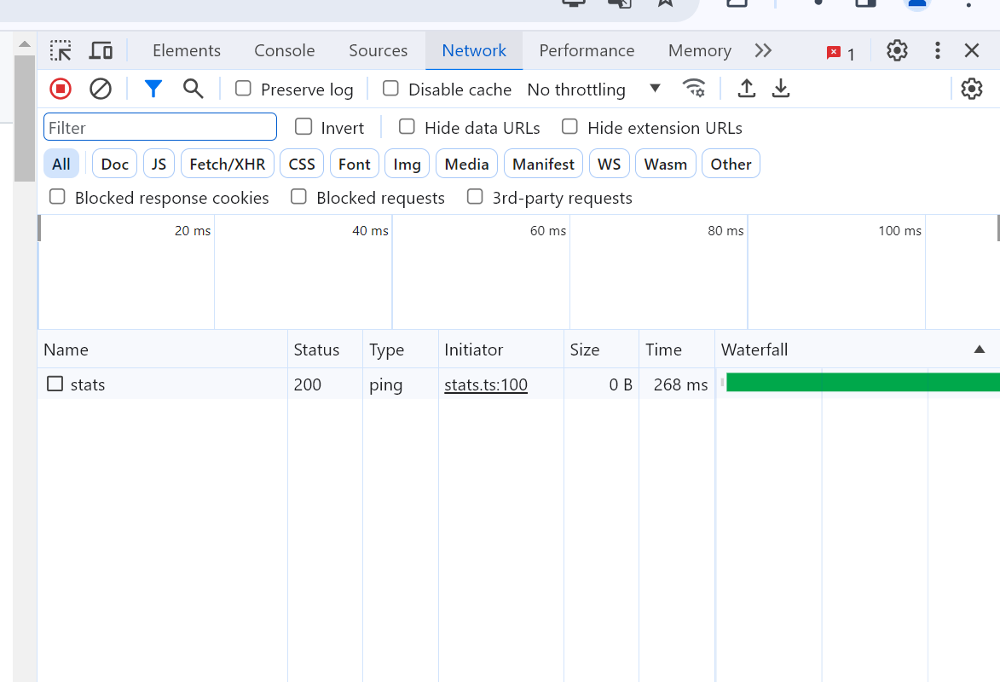
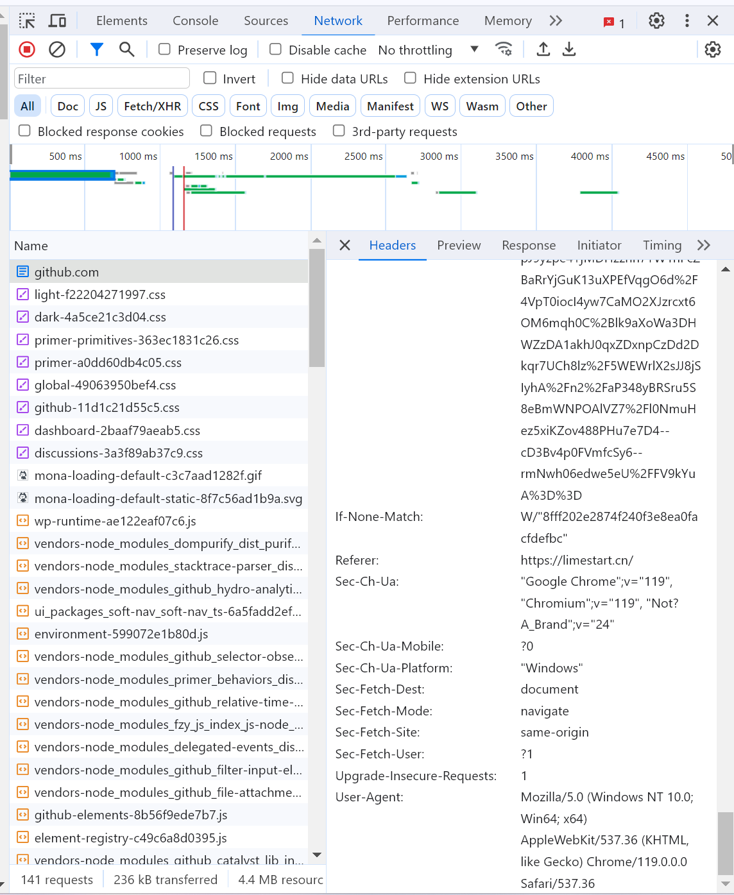
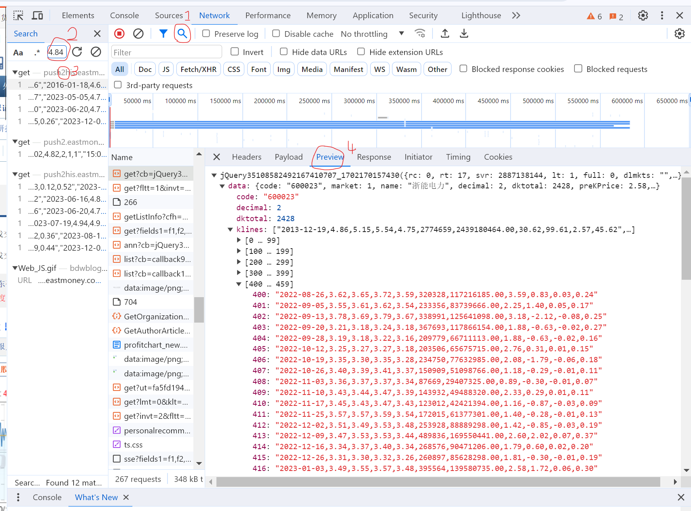
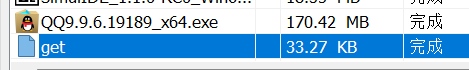

Python作为一个"简单的"高级语言(尤其在爬虫领域享有盛名),有许多第三方库来帮助我们进行爬虫.爬虫,就是从互联网上获取定向的信息和数据,再进行分析和利用的方法.其中,bs4中的[BeautifulSoup](https://beautifulsoup.cn/)是一个分析网页内容的库,requests是一个从指定链接获取互联网内容的库.

* 下载bs4库

``` shell
pip3 install bs4
```

* 下载requests库

``` shell
pip3 install requests
```

注意,如果下载速度很慢,记得去换成国内镜像源

### 第一步:得到网页

首先我们必须知道,传统的计算机是无法直接以人类的眼光来看待"网页"这一事物的.例如,相对位置、颜色、表格等,甚至不能正确处理未经过处理的文本信息.因此,网页实际上是由一个个"标签"组成的.例如,\<p>\</p>这一对标签,就是指出了这是一个"paragraph"(段落).计算机正是通过这一个个标签来分别处理不同的文字、图片等信息的.

我们为了处理网页,必须先得到网页本身.首先,我们必须得到网页的源代码,也就是带有标签信息的原始网页文件(.html).我们可以很方便的地使用requests库来得到这一源码.例如:

``` py3
import requests

web=requests.get("https://www.baidu.com/")
#web.encoding="UTF-8"
code_text=web.text  #.text参数获取源代码

print(code_text)
```

执行这段代码后的结果:

``` shell
<!DOCTYPE html>
<!--STATUS OK--><html> <head><meta http-equiv=content-type content=text/html;charset=utf-8><meta http-equiv=X-UA-Compatible content=IE=Edge><meta content=always name=referrer><link rel=stylesheet type=text/css href=https://ss1.bdstatic.com/5eN1bjq8AAUYm2zgoY3K/r/www/cache/bdorz/baidu.min.css><title>ç¾åº¦ä¸ä¸ï¼ä½ å°±ç¥é</title></head> <body link=#0000cc> <div id=wrapper> <div id=head> <div class=head_wrapper> <div class=s_form> <div class=s_form_wrapper> <div id=lg>  </div> <form id=form name=f action=//www.baidu.com/s class=fm> <input type=hidden name=bdorz_come value=1> <input type=hidden name=ie value=utf-8> <input type=hidden name=f value=8> <input type=hidden name=rsv_bp value=1> <input type=hidden name=rsv_idx value=1> <input type=hidden name=tn value=baidu><span class="bg s_ipt_wr"><input id=kw name=wd class=s_ipt value maxlength=255 autocomplete=off autofocus=autofocus></span><span class="bg s_btn_wr"><input type=submit id=su value=ç¾åº¦ä¸ä¸ class="bg s_btn" autofocus></span> </form> </div> </div> <div id=u1> <a href=http://news.baidu.com name=tj_trnews class=mnav>æ°é»</a> <a href=https://www.hao123.com name=tj_trhao123 class=mnav>hao123</a> <a href=http://map.baidu.com name=tj_trmap class=mnav>å°å¾</a> <a href=http://v.baidu.com name=tj_trvideo class=mnav>è§é¢</a> <a href=http://tieba.baidu.com name=tj_trtieba class=mnav>è´´å§</a> <noscript> <a href=http://www.baidu.com/bdorz/login.gif?login&amp;tpl=mn&amp;u=http%3A%2F%2Fwww.baidu.com%2f%3fbdorz_come%3d1 name=tj_login class=lb>ç»å½</a> </noscript> <script>document.write('<a href="http://www.baidu.com/bdorz/login.gif?login&tpl=mn&u='+ encodeURIComponent(window.location.href+ (window.location.search === "" ? "?" : "&")+ "bdorz_come=1")+ '" name="tj_login" class="lb">ç»å½</a>');
                </script> <a href=//www.baidu.com/more/ name=tj_briicon class=bri style="display: block;">æ´å¤äº§å</a> </div> </div> </div> <div id=ftCon> <div id=ftConw> <p id=lh> <a href=http://home.baidu.com>å³äºç¾åº¦</a> <a href=http://ir.baidu.com>About Baidu</a> </p> <p id=cp>&copy;2017&nbsp;Baidu&nbsp;<a href=http://www.baidu.com/duty/>使ç¨ç¾åº¦åå¿è¯»</a>&nbsp; <a href=http://jianyi.baidu.com/ class=cp-feedback>æè§åé¦</a>&nbsp;京ICPè¯030173å·&nbsp;  </p> </div> </div> </div> </body> </html>
```

可以看到,这段结果非常混乱.主要有两个问题:

* 返回的源代码没有正确换行
* 出现了特殊的字符乱码(实际上是中文)

第二个问题实际上是编码的问题.我们取消代码中的注释,这表明以"UTF-8"这一字符编码标准进行解码,我们会发现这次它正确地返回了中文字符(这里输出结果省略).

但是第一个问题并没有得到解决.

我们加入BeautifulSoup这个库.这个库可以用来快速分析html的内容.
例如:

``` py3
from bs4 import BeautifulSoup 
import requests

web=requests.get("https://www.baidu.com/")
web.encoding="UTF-8"
text=web.text  #.text参数获取源代码

soup=BeautifulSoup(text,"html.parser")  #"html.parser"是一个python自带的html分析器，用来正确解析html的内容。BeautifulSoup()返回一个BeautifulSoup对象。

print(soup.prettify())  #.prettify()方法获取html的美化排版
```

这次我们正确获得了正确的排版.实际上,对于html分析器,我们更推荐使用"lxml"而不是"html.parser",因为前者的兼容性更好,速度也更快(注意需要另外下载和导入库).

### 获取想要的内容(静态)

好吧,实际上,是否获得正确的排版对我们爬取内容无关.所以我们下面来讲一下爬取对应的内容.

网页的内容分为静态内容和动态内容.例如,[哔哩哔哩](https://www.bilibili.com)首页推荐的时评内容是动态内容(不能固定).而像一些政府网站,例如[浙江省教育考试院](https://www.zjzs.net/moban/index/index.html)首页的内容就是静态内容,每次刷新我们都可以获得相同的内容.

首先简单看一下如何手动查找html的内容.(下面以chrome浏览器为例.其他浏览器类似同理)

* 找到你想要的网页,按下键盘的F12,打开浏览器的调试窗口
  
* 点击左上角的箭头标志,然后鼠标点击网页中的对应内容.
  
  可以看见右边的源代码中对应的标签被阴影化.这就是我们需要的内容了.

对于静态网页,我们可以简单地分析html源代码来获取想要的文件.
以下是BeautifulSoup给出的一些简单的处理方法(具体的html概念可能需要另行了解)

获取标签的方法如下:

``` py3
from bs4 import BeautifulSoup

soup=BeautifulSoup("html.txt","lxml") #先导入网页源码

tag=soup.a #返回文档里第一个超链接tag元素

tags=soup.find_all("a") #a是html中的链接标签。这个语句获取所有超链接tag,按顺序返回一个列表，每个元素都是一个tag元素。下面的搜索方法也可以使用find_all方法

tag=soup.find("a") #返回文档里第一个超链接tag元素
tag=soup.find(class_="class0") #取第一个class值为“class0”的标签
tag=soup.find(id="id0") #获取第一个id值为“id0”的标签
tag=soup.find(attrs={"id":"id_1","class":"style_1"}) #多条件需要使用attrs属性

tags=soup.select("title") #按照标签查找
tags=soup.select(".style1") #按照class查找
tags=soup.select("#id0") #按照id查找
tags=soup.select("p > b") #按照父子关系查找
tags=soup.select('a[href="http://example.com/"]') #按照属性值查找。href的值是这个链接指向的网址
#以上方法均可以以空格为间隔，混用输入多个要求来获得tag。返回值均为列表。
```

tag的属性值:
假设该标签为:

``` html
<a href="www.baidu.com" class="style_1" id="id_1">百度一下</a>
```

``` py
>>>tag.name
a
>>>tag.attrs
{'href': 'www.baidu.com', 'class': ['style_1'], 'id': 'id_1'}
>>>tag.string
百度一下
```

可以用字典方法修改单个tag中attrs的某个属性.不存在的属性将被创建并赋值

``` py
tag["class"]="stylecss" #设置tag的标签属性。这里设置的是class属性。像这样能带有多个class值的属性，全部属性（包括只有一个时）以空格为间隔都会转化成列表的方式储存。可以直接赋值成多个值的列表
```

当然,也可以直接用类的属性值直接更改整个tag

``` py
tag.name="a_name" #不建议，因为一般设置的name对html无效
tag.atrrs={'class': ['style_1'], 'id': 'id_1'} #注意，重新赋值的时候，没有手动赋值的内容将会被删除
```

### 反爬虫与反反爬虫

事实上,为了确保用户数据的安全,网页的html源码往往只会给出一个基础框架而不包含数据.为了获得我们需要的数据,我们必须在合理的范围内对这种反爬虫进行突破.

事实上,有一个很简单且适用于大量小型网页的方法:伪装请求头(headers).这可以让服务器误以为是用户使用浏览器在获取数据,从而正常地来给用户发送需要的数据.需要注意的是,不同的浏览器有不同的UA,服务器发送的数据也不一定相同.比如iOS上Safari浏览器会引导用户到App Store上下载软件,而安卓系统往往会直接允许用户下载安装包等.

下面给出获得直接浏览器UA的办法:

* 打开任意网页,按下键盘的F12,选中上方Network.
  
* 按下键盘的F5刷新页面.发现下方Name下出现大量数据.任意选中一个,在右侧的窗口上方选中Headers,再在下面中找到User-Agent变量.复制右侧的值即可.
  

### 获得动态的内容

动态的内容往往是使用js(JavaScript,一种编程语言)来逐一向服务器发送请求数据.这个时候,数据就不是存在原本html源码里了(这种情况下,html源码往往是个空壳),因此,当我们用上面的方法获取内容时,往往只能得到空的值或无效的值.

为了获得数据,我们必须找到请求真实数据的url.一般来说,我们可以以如下方法简单地进行手动查找:(以下以东方财富网的某个股票页面举例.当前页面时间为2023-12-10)

* 打开F12,点击Network后刷新,获得全部的names
* 使用搜索功能,输入当前在页面上看到的涨跌数字
* 在下方的搜索结果中寻找"get"项下,带有当前时间的数据,点击后,在右侧的窗口中点击"Preview".在下方的数据中尝试查看有效数据
  

可以看到很快就找到了我们需要的内容.一般来说,对于获取到的这样的"列表类"数据,我们需要使用json格式来处理,并且我们只需要简单地对比网页中的数据,就可以知道某个值的第几位是什么作用.

* 此时点击中间names栏的选中值,这个就是我们需要的url.
  事实上,即使我们在浏览器中打开这个url,并且显示的内容是一个网页,它也并非是一个网页.(怎么可能会有一个静态网页来储存动态数据呢?)其实,我们在下载器中下载这个地址,会发现下载的文件没有任何后缀名:
  
* 但是,我们可以用一些打开方式看到里面的数据(例如vscode),可以看到里面的数据和我们一开始在浏览器F12里看到的一致.这个时候我们就不需要使用bs4来处理网页的内容了.取而代之的,是json的分析方法.我们可以使用json模块对python的字符串进行处理,使之成为能够认读的json字符串.这种字符串可以以索引方式读写.
  我们使用如下的函数:

  ``` python
  import json
  #example jsondata
  string='''[{"data1": "value1", "data2": "value2"},{"data1": "value3","data2": "value4"}]''' #注意，在编写自己的数据的时候，内部的引号必须使用双引号，否则报错
  json_string=json.loads(string)
  print(json_string[0]['data1'])

  >>>value1
  ```
  
* 但是,和传统的json格式不同,我们发现这个文件里的前面内容包含了"jQuery351049610706292989315_1702212722432"这样一串作为标记的噪音数据.我们需要先截取一段长度作为真正需要读取的字符串,然后进行处理.这个还挺简单的,我们按照长度截取就行.
* 同时,网页的开发者数据中很容易看出数据的包裹和分类情况(参见本小节图一)

接下来使用requests和json模块处理,处理"浙能电力"这一股票:

``` py
import requests
import json

headers={'User-Agent':'Mozilla/5.0 (Windows NT 10.0; Win64; x64) AppleWebKit/537.36 (KHTML, like Gecko) Chrome/119.0.0.0 Safari/537.36'}
web=requests.get("https://push2his.eastmoney.com/api/qt/stock/kline/get?cb=jQuery351049610706292989315_1702212722432&secid=1.600023&ut=fa5fd1943c7b386f172d6893dbfba10b&fields1=f1%2Cf2%2Cf3%2Cf4%2Cf5%2Cf6&fields2=f51%2Cf52%2Cf53%2Cf54%2Cf55%2Cf56%2Cf57%2Cf58%2Cf59%2Cf60%2Cf61&klt=101&fqt=1&beg=0&end=20500101&smplmt=460&lmt=1000000&_=1702212722433",headers=headers)
web.encoding="UTF-8"
text=web.text  #.text参数获取源代码

text_=json.loads(text[42:-2]) #从第四十二位截断，去除噪音直到倒数第三位，去除多余的括号和分号

print((text_["data"]["klines"][-1]).split(",")[3]) #获取最新的涨跌幅数据
```


处理获取所有股票涨跌的实例:
``` py
import requests
import json
import time


headers={'User-Agent':'Mozilla/5.0 (Windows NT 10.0; Win64; x64) AppleWebKit/537.36 (KHTML, like Gecko) Chrome/119.0.0.0 Safari/537.36'}
for i in range(0,999999+1):
    code=str("%06d"%i)
    web=requests.get("https://push2his.eastmoney.com/api/qt/stock/kline/get?cb=jQuery351049610706292989315_1702212722432&secid=1."+code+"&ut=fa5fd1943c7b386f172d6893dbfba10b&fields1=f1%2Cf2%2Cf3%2Cf4%2Cf5%2Cf6&fields2=f51%2Cf52%2Cf53%2Cf54%2Cf55%2Cf56%2Cf57%2Cf58%2Cf59%2Cf60%2Cf61&klt=101&fqt=1&beg=0&end=20500101&smplmt=460&lmt=1000000&_=1702212722433",headers=headers)
    web.encoding="UTF-8"
    text=web.text  #.text参数获取源代码

    text_=json.loads(text[42:-2]) #从第四十二位截断，去除噪音直到倒数第三位，去除多余的括号和分号

    check=len(text or text_["data"]["klines"]==[]) #国债以及不存在的股票没有数据，跳过
    if check<200:
        continue
    
    flag=-1
    if float(text_["data"]["klines"][-1].split(",")[-2])>=0:
        flag=1

    print("今日该代码:",code,"股票涨跌:",float(text_["data"]["klines"][-1].split(",")[3])*flag)
    time.sleep(1) #使用sleep防止被ban
```
